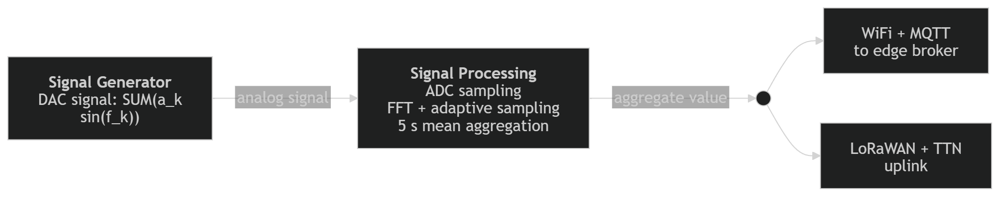
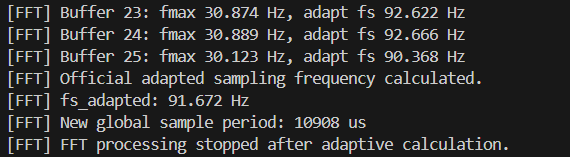
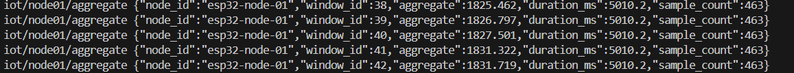
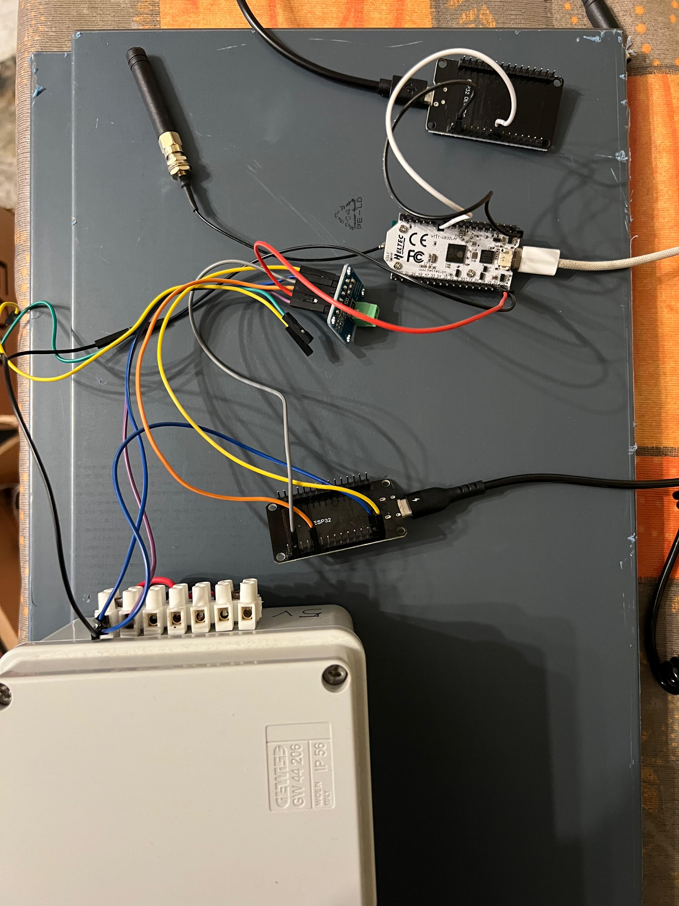
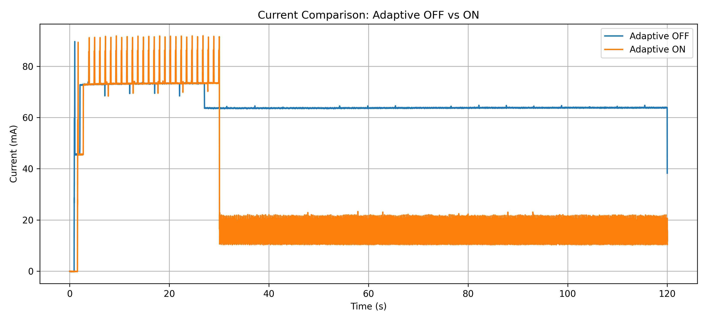
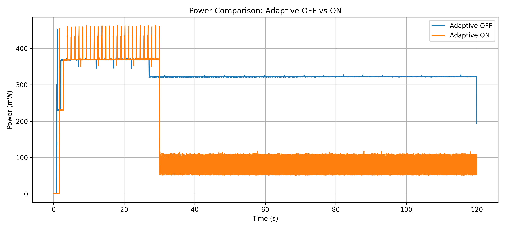
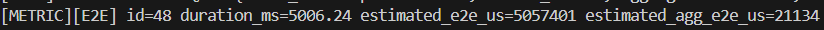

# IoT Individual Assignement

This project implements an IoT system based on ESP32 boards and FreeRTOS that acquires an analog signal, analyzes it locally through FFT, adapts the sampling frequency to the signal bandwidth, computes the average over a 5-second window, and sends the aggregated value both to a nearby edge server through MQTT over WiFi and to the cloud through LoRaWAN and The Things Network (TTN).

The implementation is organized as a reproducible experimental setup: one ESP32 generates a synthetic signal, one Heltec WiFi LoRa 32 V3 samples and processes it, a local MQTT broker receives the edge aggregate, and TTN receives the cloud uplink.

## Index

- [System Architecture](#system-architecture)
- [Hardware and Software Setup](#hardware-and-software-setup)
- [Configuration and How to Run](#configuration-and-how-to-run)
- [Requirements Implementation](#requirements-implementation)
- [Performance Evaluation](#7-performance-evaluation)

## System Architecture



System flow:

1. The `signalgenerator` firmware produces a signal on the ESP32 DAC.
2. The `signalprocessing` firmware samples the signal from the ADC.
3. An FFT is computed on an initial high-rate acquisition window.
4. The maximum significant frequency component is used to derive a lower sampling frequency.
5. Samples are aggregated over a 5 s window by computing the arithmetic mean.
6. The aggregated value is sent to the edge server via MQTT over WiFi.
7. The same aggregated value is sent to the cloud via LoRaWAN and TTN.

## Hardware and Software Setup

### Hardware

- 1x ESP32 development board used as signal generator
- 1x Heltec WiFi LoRa 32 V3 used as signal processing node
- DAC to ADC connection:
  - generator `GPIO25` DAC output -> processing node `GPIO2` ADC input
  - common GND between the two boards
- 1x nearby machine running a Mosquitto MQTT broker
- LoRaWAN coverage and a TTN application/device configured for the Heltec board

### Software

- [PlatformIO](https://platformio.org/) for build, upload, and serial monitor
- Arduino framework on ESP32
- Main libraries declared in [`ind_assign_project/platformio.ini`](./ind_assign_project/platformio.ini):

### PlatformIO environments

- `signalgenerator`: firmware for the ESP32 signal generator
- `signalprocessing`: adaptive processing firmware for the Heltec board
- `signalprocessing_maxrate`: benchmark firmware used to identify the maximum ADC sampling rate of the processing board

## Configuration and How to Run

### Main configuration parameters

The most relevant parameters are defined in [`ind_assign_project/include/config.hpp`](./ind_assign_project/include/config.hpp):

- `ADAPTIVE_SAMPLING_FREQUENCY_ENABLED = true`
  - enables or disables the FFT-based adaptive sampling logic
- `ADAPTIVE_SAMPLING_ROUNDS = 25`
  - number of FFT windows averaged before locking the adapted sampling rate
- `LIGHT_SLEEP_TEST_MODE_ENABLED = false`
  - enables light-sleep benchmarking mode and disables the communication task
- `FFT_DEBUG_VERBOSE = false`
  - prints detailed FFT diagnostics instead of the short summary output

The remaining constants in `config.hpp` define timing, thresholds, and queue sizes used by the current implementation, but the four flags above are the ones most useful to change while reproducing the experiments or debugging the pipeline.

Network credentials and TTN keys are expected in `ind_assign_project/include/secrets.hpp`, which is intentionally not included in the repository. The file should define the WiFi credentials, the MQTT broker address, and the TTN OTAA identifiers used by the communication modules. A minimal template is:

```cpp
#pragma once

constexpr char WIFI_SSID[] = "your-wifi-ssid";
constexpr char WIFI_PASSWORD[] = "your-wifi-password";
constexpr char MQTT_BROKER[] = "your-ip";

constexpr uint8_t TTN_JOIN_EUI[8] = { 0x00, 0x00, 0x00, 0x00, 0x00, 0x00, 0x00, 0x00 };
constexpr uint8_t TTN_DEV_EUI[8]  = { 0x00, 0x00, 0x00, 0x00, 0x00, 0x00, 0x00, 0x00 };
constexpr uint8_t TTN_APP_KEY[16] = {
    0x00, 0x00, 0x00, 0x00, 0x00, 0x00, 0x00, 0x00,
    0x00, 0x00, 0x00, 0x00, 0x00, 0x00, 0x00, 0x00
};
```

### Flash the signal generator

```powershell
cd ind_assign_project
pio run -e signalgenerator -t upload
pio device monitor -e signalgenerator
```

### Flash the adaptive signal processing node

```powershell
cd ind_assign_project
pio run -e signalprocessing -t upload
pio device monitor -e signalprocessing
```

### Run the maximum sampling rate benchmark

```powershell
cd ind_assign_project
pio run -e signalprocessing_maxrate -t upload
pio device monitor -e signalprocessing_maxrate
```

### Start the MQTT broker

From the `ind_assign_project` folder, a local Mosquitto instance can be started with:

```powershell
mosquitto -c mosquitto.conf
```

To observe publications:

```powershell
mosquitto_sub -h <broker-ip> -t iot/node01/aggregate -v
```

### TTN / LoRaWAN setup

Before running the cloud path:

1. Create a TTN application and device.
2. Copy `JoinEUI`, `DevEUI`, and `AppKey` into `secrets.hpp`.
3. Ensure the device uses the EU868 region, matching the `platformio.ini` configuration.
4. Open the TTN Live Data view to verify uplinks.

## Requirements Implementation

## 0. FreeRTOS Design

The processing firmware is organized around four FreeRTOS tasks in [`ind_assign_project/src/signalprocessing/main.cpp`](./ind_assign_project/src/signalprocessing/main.cpp):

- `TaskSample`: acquires ADC samples and feeds both FFT and aggregation queues
- `TaskFFT`: analyzes samples buffers and computes the adapted sampling frequency
- `TaskAggregateValue`: computes the mean over each 5-second window
- `TaskCommunication`: handles MQTT and LoRaWAN communication

The tasks exchange data through queues:

- FFT free/ready queues for pre-allocated FFT buffers
- sample queue for aggregation samples
- communication queue for completed aggregate values

## 1. Input Signal Model

**Goal**

Generate an input signal of the form:  $\sum_k a_k \sin(2 \pi f_k t)$

**Implementation**

The signal is generated by the firmware in [`ind_assign_project/src/signalgenerator/main.cpp`](./ind_assign_project/src/signalgenerator/main.cpp). The sinusoidal components to be summed are defined explicitly in the `SIGNAL_COMPONENTS[]` array:

```cpp
constexpr SineComponent SIGNAL_COMPONENTS[] = {
    {3.0f, 50.0f, 0.0f},
    {14.0f, 20.0f, 0.0f},
    {30.0f, 2.0f, 0.0f},
};
```

Each entry has the form:
- frequency in Hz
- amplitude
- phase in radians

The generator updates DAC `GPIO25` every `61 us`. At each update instant, it computes the current time `t`, evaluates every sinusoidal component, and sums all contributions into a single sample value.

The important implementation detail is that the ESP32 DAC does not accept negative values. The `dacWrite()` API expects an unsigned 8-bit value in the range `[0, 255]`, while a pure sum of sinusoids is naturally centered around zero and can become negative during part of the waveform. For this reason, the firmware starts from a fixed DC offset and then adds the sinusoidal terms on top of that offset. In practice, instead of generating a waveform centered around `0`, the code generates one centered around `127`, which is the middle of the DAC range. This allows the positive and negative oscillations of the mathematical signal to be represented as valid DAC codes. After the sum is computed, the sample is clipped before being sent to the DAC to respect the 8-bit value range.

**Expected boot output**
```text
Signal Generator boot
DAC pin: GPIO25
Signal components: 3
  0: freq 3.00 Hz, amp 50.00, phase 0.00 rad
  1: freq 14.00 Hz, amp 20.00, phase 0.00 rad
  2: freq 30.00 Hz, amp 2.00, phase 0.00 rad
Update period: 61 us
```

## 2. Maximum Sampling Frequency

**Goal**

Identify the maximum sampling frequency supported by the hardware when continuously sampling with `analogRead()`.

**Implementation**

The benchmark firmware is implemented in [`ind_assign_project/src/signalprocessing_maxrate/main.cpp`](./ind_assign_project/src/signalprocessing_maxrate/main.cpp). It performs repeated 1-second acquisition runs, counts the number of samples collected, and computes:

- average throughput
- minimum throughput
- maximum throughput
- suggested sampling period

The benchmark uses:

- `TEST_DURATION_MS = 1000`
- `NUM_RUNS = 15`

The benchmark prints lines of the following form:

```text
Run 1
  Samples acquired : ...
  Elapsed time     : ... us
  Throughput       : ... samples/s

==== Summary ====
Average throughput : ... samples/s
Minimum throughput : ... samples/s
Maximum throughput : ... samples/s
Suggested period   : ... us
```

**Result**

The experiments showed that the board can sustain a sampling rate on the order of `16.4 kHz`, corresponding to a sampling period of about `61 us`, which was then selected as the initial oversampled configuration for the main pipeline.

## 3. Optimal Sampling Frequency via FFT

**Goal**

Estimate the maximum significant frequency component of the signal and adapt the sampling frequency accordingly.

**Implementation**

FFT analysis is implemented in [`ind_assign_project/lib/fft_processing/fft_processing.cpp`](./ind_assign_project/lib/fft_processing/fft_processing.cpp). The processing node:

1. collects `SAMPLES = 16384` samples at the initial oversampled rate,
2. computes the effective sampling frequency of the FFT window,
3. centers the signal by removing the mean,
4. computes the FFT using `arduinoFFT`,
5. finds the last _significant_ spectral bin ,
6. derives the new sampling frequency according to Nyquist theorem as: $f_{s,adapted} = 2 \cdot f_{ref} \cdot ADAPTIVE\_MARGIN$, where `f_ref` is the maximum significant frequency, lower-bounded by `MIN_ADAPTED_FS = 10 Hz`.

In this project, a _significant_ bin is an FFT frequency bin whose magnitude is large enough to be considered a meaningful component of the input signal, rather than noise or a negligible spectral artifact, in particular: $|X[k]| \geq \text{SIGNIFICANCE\_RATIO} \cdot \max_j |X[j]|$


where $|X[k]|$ is the magnitude of the \(k\)-th FFT bin and SIGNIFICANCE_RATIO = 0.018 in the current configuration. This means that a bin is considered significant only if its magnitude is at least `1.8%` of the maximum spectral magnitude.

The firmware averages the adapted frequency over `ADAPTIVE_SAMPLING_ROUNDS = 25` FFT windows before updating the global sampling period and suspending the FFT task.

The serial monitor reports FFT summaries such as:

```text
[FFT] Buffer 1: fmax ... Hz, adapt fs ... Hz
...
[FFT] Official adapted sampling frequency calculated.
[FFT] fs_adapted: ... Hz
[FFT] New global sample period: ... us
```

If `FFT_DEBUG_VERBOSE` is enabled, the firmware prints a detailed FFT report instead of the compact summary.

**Result**



## 4. Aggregate Function Over a Window

**Goal**

Compute an aggregate value (average) over a fixed time window, in this case 5 seconds.

**Implementation**

Aggregation is implemented in [`ind_assign_project/lib/aggregation/aggregation.cpp`](./ind_assign_project/lib/aggregation/aggregation.cpp). Each acquired sample is pushed to a queue and consumed by the aggregation task, which:

- initializes a new window with the timestamp of the first sample,
- accumulates the sample values,
- counts the number of samples,
- closes the window when elapsed time reaches `AGGREGATION_WINDOW_MS = 5000`,
- computes the arithmetic mean.

**Result**


## 5. Communication to Nearby Edge Server via MQTT over WiFi

**Goal**

Send the aggregated value to a nearby edge server using MQTT over WiFi.

**Implementation**

The edge communication module is implemented in [`ind_assign_project/lib/comm_edge/comm_edge.cpp`](./ind_assign_project/lib/comm_edge/comm_edge.cpp). The processing node:

- connects to WiFi in station mode,
- enables WiFi modem sleep,
- connects to the MQTT broker on port `1883`,
- publishes the aggregate to topic `iot/node01/aggregate`.

Published JSON payload:

```json
{
  "node_id": "esp32-node-01",
  "window_id": 1,
  "aggregate": 1234.567,
  "duration_ms": 5000.0,
  "sample_count": 463
}
```

**Result**



## 6. Communication to the Cloud via LoRaWAN and TTN

**Goal**

Send the same aggregate value to the cloud through LoRaWAN and TTN.

**Implementation**

The cloud communication module is implemented in [`ind_assign_project/lib/comm_cloud/comm_cloud.cpp`](./ind_assign_project/lib/comm_cloud/comm_cloud.cpp). The node uses OTAA activation with TTN credentials stored in `secrets.hpp`, then queues one compact binary uplink payload per aggregate.

Payload format:

- bytes `0-1`: `window_id` as `uint16_t`
- bytes `2-5`: `mean` as `float`

Total payload size: `6 bytes`

The node transmits on LoRaWAN application port `1` and uses the `EU868` region.

**Result**

```text
real output
```

## 7. Performance Evaluation

### 7.1 Energy Savings

**Goal**

Estimate the energy savings enabled by the reduced sampling frequency.

**Implementation**

To isolate the impact of adaptive sampling on local energy consumption, the communication paths were disabled during this experiment. 
The comparison was performed between:

- `ADAPTIVE OFF`: adaptive sampling disabled
- `ADAPTIVE ON`: adaptive sampling enabled together with light sleep between sampling instants

Current and power were measured with an `INA219` over a `120 s` observation window for each configuration. The sensor was connected to a dedicated ESP running the `energy_consumption` firmware contained in [`ind_assign_project/src/energy_consumption/main.cpp`](./ind_assign_project/src/energy_consumption/main.cpp).



**Measured values**




| Metric | Adaptive OFF | Adaptive ON |
| --- | ---: | ---: |
| Duration (s) | 119.997 | 120.044 |
| Avg current (mA) | 65.066 | 28.989 |
| Avg power (mW) | 328.947 | 146.071 |
| Energy (mJ) | 39,471.314 | 17,527.184 |
| Energy (mWh) | 10.964254 | 4.868662 |

**Result**

With communications disabled, the adaptive configuration consumed significantly less energy than the non-adaptive one. Over the 120-second measurement window, enabling adaptive sampling reduced average current by `55.45%`, average power by `55.59%`, and total energy by `55.60%`.


### 7.2 Per-Window Execution Time

**Goal**

Measure the local processing cost required to produce one aggregate value.

**Implementation**

The aggregation task tracks the total processing overhead spent updating the current window and building the aggregate. For each completed window, it prints a dedicated metric line:


**Result**

Measured values currently collected in this project:

| Metric | No Adaptive Sampling | Adaptive Sampling |
| --- | ---: | ---: |
| Samples per window | ~72,369 | 457 |
| Execution time per window | ~116,600 us | ~1,458 us |

The adaptive configuration reduces execution time by about `80x` and the number of processed samples by about `158x`, showing that most of the local computation cost comes from oversampling.

### 7.3 Volume of Data Transmitted

**Goal**

Compare the communication volume of the adaptive configuration against the oversampled one.

**Implementation**

The implemented system always sends one aggregate per 5-second window instead of sending raw samples.
Communication payloads per aggregation window:
| Channel | Payload |
| --- | ---: |
| MQTT / Edge | JSON buffer of 160 bytes |
| LoRaWAN / TTN | 6 bytes |

**Result**

Compared to transmitting all raw samples, the aggregate-only design dramatically reduces network traffic. In the current implementation, the network traffic does not materially change between baseline and adaptive configurations, because the system always sends exactly one aggregate for each fixed 5-second time window. Therefore, adaptive sampling does not reduce the transmitted network volume in the current design.

### 7.4 End-to-End Latency

**Goal**

Estimate the latency from data generation to reception at the edge side.

**Implementation**

After publishing the aggregate to MQTT, the firmware computes two latency-oriented metrics:

- `estimated_e2e_us`: from the timestamp of the first sample in the window to the end of the local send operation, plus half of a fixed MQTT RTT
- `estimated_agg_e2e_us`: from aggregate readiness to local send completion

The fixed edge RTT used by the firmware is:

- `EDGE_RTT_FIXED_US = 60000` estimated throug experimentation

The runtime log prints:



Measured values currently collected in this project:

| Metric                 |    Mean (us) | Mean (ms) |
| ---------------------- | -----------: | --------: |
| `estimated_e2e_us`     | 5,055,126.07 |   5055.13 |
| `estimated_agg_e2e_us` |    50,391.63 |     50.39 |


**Result**

The dominant contribution to end-to-end latency is the 5-second aggregation window itself, while the incremental delay from aggregate readiness to edge transmission is only about `50.4 ms`.
